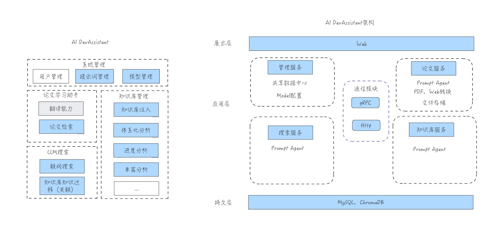
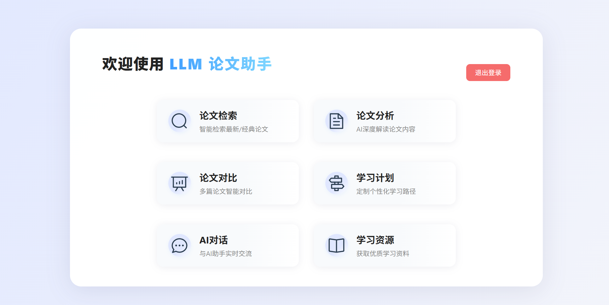
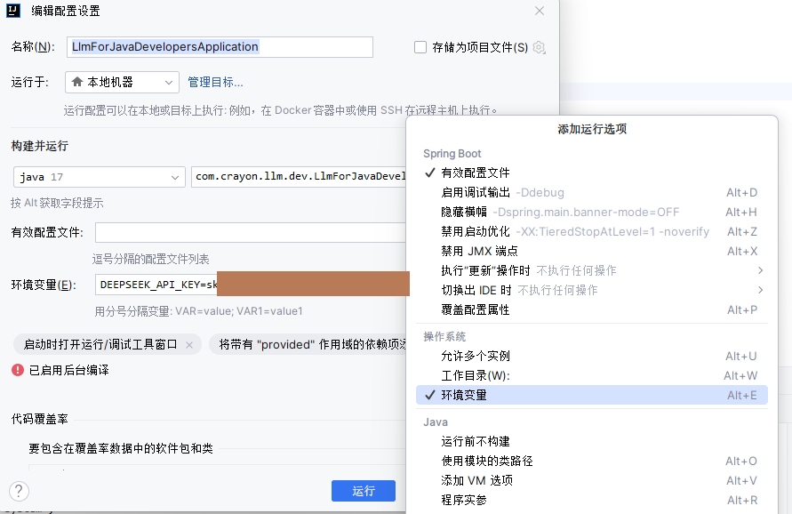

# 面向Java程序员的LLM应用开发助手项目

1️⃣ 项目旨在深入企业级LLM应用细节，通过实战项目，帮助开发者更好地理解和应用LLM应用开发技术。  
2️⃣ 项目仅为练习项目，原则是最小可行性，探究LLM应用细节。  
3️⃣ 项目整理有其它优秀的项目。

## 文档doc

里面有简单的系统设计与部分详细设计。
也是项目目的的具象化。

> 只看这里就行。

这里要说的是，LangChain4j文档多次提到其高级封装不具备灵活性，代码中使用了不少封装，估摸着LangChain4j的高级封装会有大改升级。

LLM应用开发学习同LangChain4j一样，是一个持续迭代的过程。

## 架构说明

## 技术栈

- Spring Boot 3.5.3
- LangChain4j 1.1.0
- 其它

### 关于前端Web

由AI生成，简单展示如下:

## 资料

- LangChain4j官网

[https://docs.langchain4j.dev/tutorials/spring-boot-integration/](https://docs.langchain4j.dev/tutorials/spring-boot-integration/)

## 配置环境变量

# Plan

觉得项目有继续写的必要的时候会继续写。目前也具备节省一点时间的参考意义就放上来。

