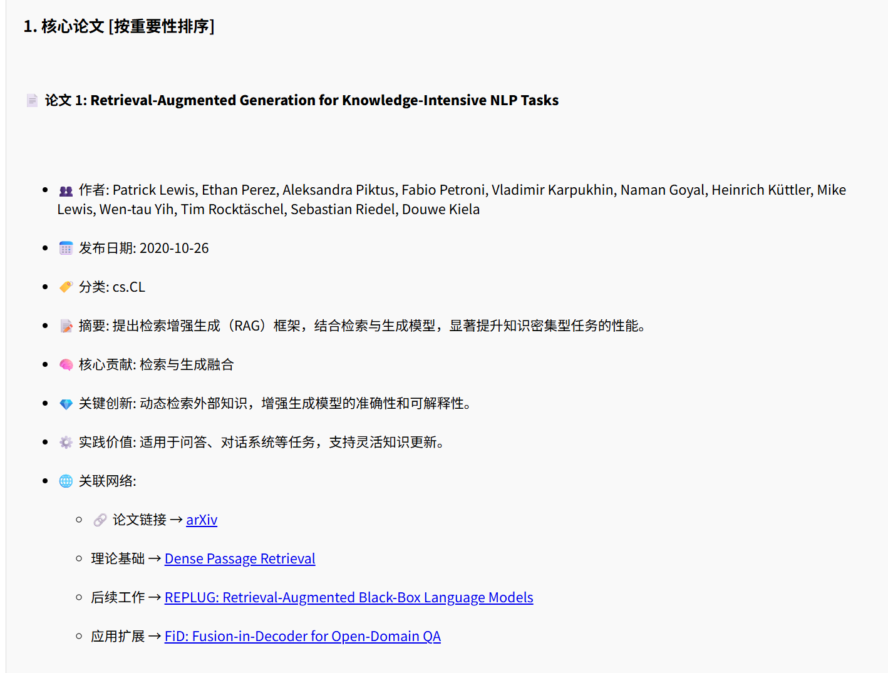

# 1.模块介绍

目标是一个自洽的论文服务。

## 功能模块

规划有论文搜索与对话聊天两个模块。

### 论文检索

提供论文检索功能，支持根据关键词、作者、标题等信息进行论文检索，支持对检索结果进行排序和筛选。

- 示例  
  Q：RAG  
  A：
  

## 当前情况说明

联网搜索工具+DS的搜索结果不如单DS搜索结果。
做了一些调整和尝试，最后发现直接调试Prompt，效果好的多。

## 搜索工具、网站的些许调研

- Semantic Scholar API  
  专业的学术搜索工具

- SerpAPI  
  支持Bing、Google、Baidu，每个月100次免费额度的搜索工具。
  每个结果都有大量结构化数据，包括链接、地址、推文、价格、缩略图、评分、评论、丰富摘要等。

https://export.arxiv.org/api/query  
https://api.semanticscholar.org/graph/v1/paper/search

### LangChain4j集成 Web Search Engines

Web搜索引擎可以用作[RAG pipeline](https://docs.langchain4j.dev/tutorials/rag#web-search-content-retriever)中的
ContentRetriever，或者用作@Tool。  
总的来说没有过多的封装。

# 2.TODO

提示词管理。
自洽性。

# 3.工程落地总结

详见/doc/system design/detailed design/

